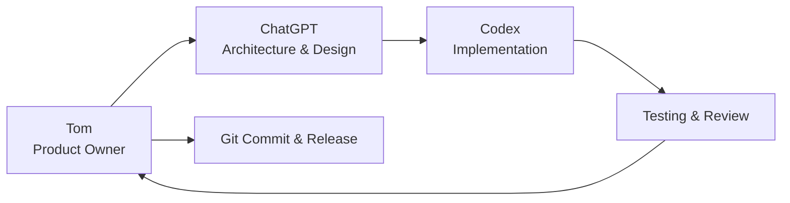

# Development Workflow

This project is developed using an AI-assisted software engineering workflow.

AI tools are used to assist with architecture, implementation, documentation and testing, while all product direction, design decisions, code review and final approval remain the responsibility of the project owner.

## Development Feedback Loop Diagram

## Development Principles

- The Product Owner defines requirements and priorities.
- Architectural decisions are discussed before implementation.
- Features are implemented incrementally.
- All code changes are reviewed before being committed.
- Documentation is maintained alongside source code.
- Architectural decisions are recorded in the Engineering Log.
- User-visible changes are recorded in the Changelog.

## AI-Assisted Development

AI is used as an engineering assistant rather than an autonomous developer.

Responsibilities include:

- brainstorming solutions
- reviewing architecture
- generating implementation suggestions
- assisting with documentation
- proposing tests

Final technical decisions remain the responsibility of the project owner.